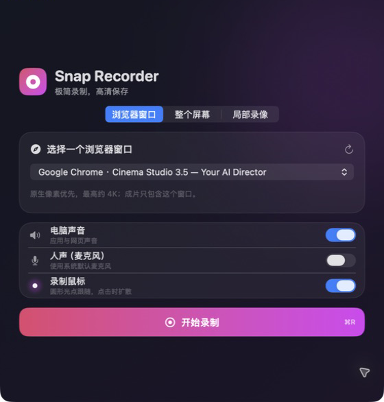
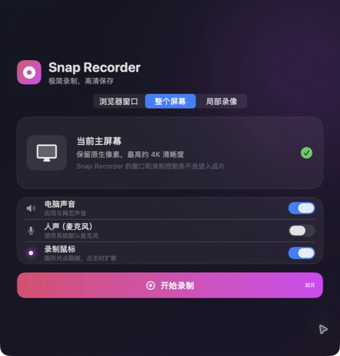
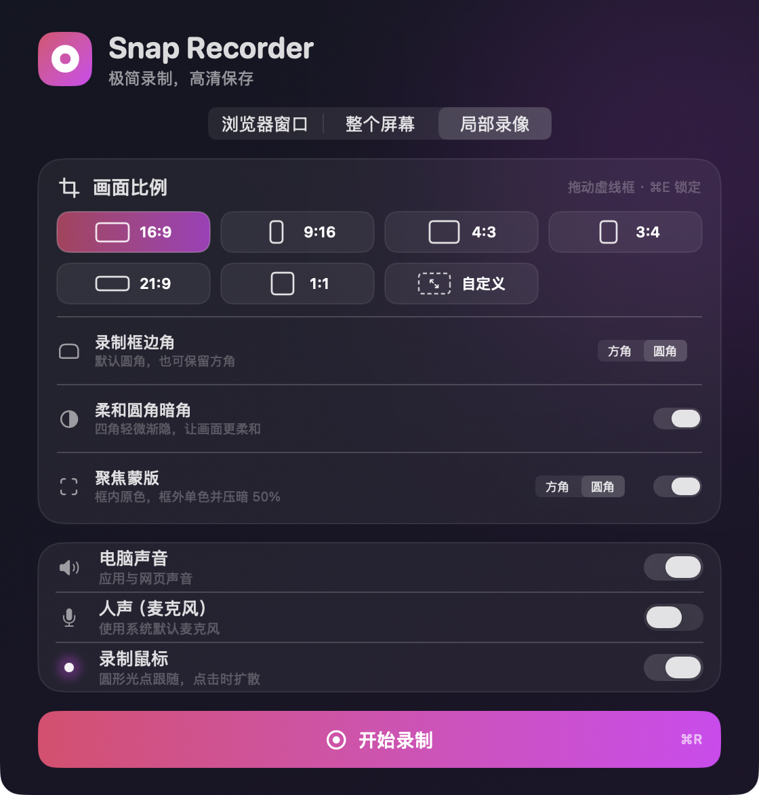
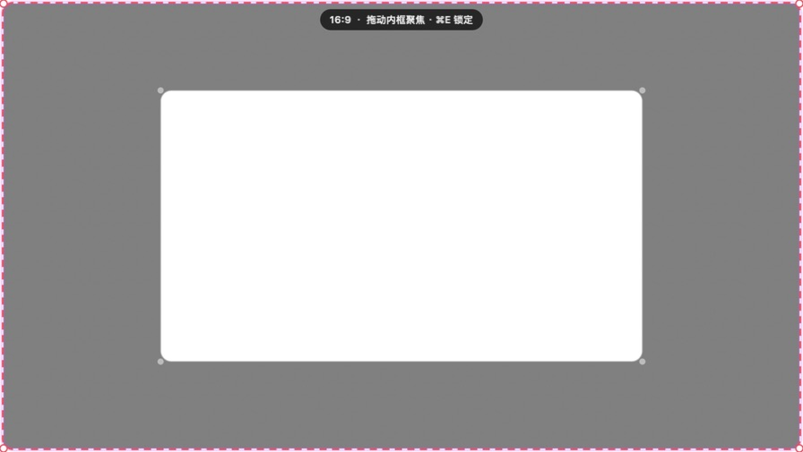
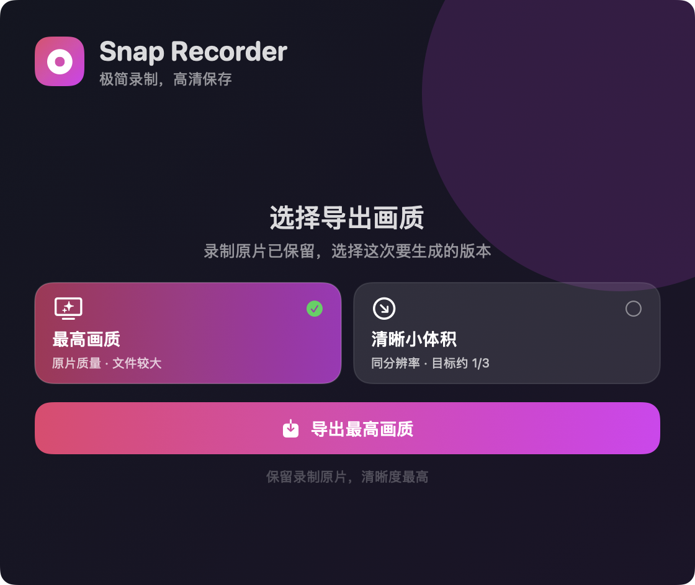

<div align="center">
  
  <h1>Snap Recorder</h1>
  <p><strong>macOS 录屏：窗口、整屏或局部区域。</strong></p>
  <p>
    <a href="https://github.com/kennanzhou/snap-recorder-Partial-recording">源码</a>
    &nbsp;·&nbsp;
    <a href="#安装与构建">安装与构建</a>
    &nbsp;·&nbsp;
    <a href="https://github.com/shuyan-5200/snap-recorder">原项目</a>
  </p>
  <p>
    <a href="LICENSE"></a>
    
    
    
  </p>
</div>

Snap Recorder 是一款本地运行的 macOS 录屏工具。选择录制模式，按 `⌘R` 开始，按 `Esc` 结束，再选择画质和保存方式。录屏不会上传。

## 1. 窗口模式（浏览器窗口）

窗口模式只录一个浏览器窗口。桌面、其他应用和 Snap Recorder 的控制界面不会出现在成片里。

<p align="center">
  
  <br>
  <sub>窗口模式：从列表选择要录制的浏览器窗口</sub>
</p>

1. 打开准备录制的浏览器窗口。
2. 在 Snap Recorder 中选择“浏览器窗口”。
3. 从列表中选中目标窗口；找不到时，点右侧刷新按钮。
4. 设置声音和鼠标后，点击“开始录制”或按 `⌘R`。

窗口不必最大化，但不能最小化。成片保持窗口原比例，优先使用原生像素，最高约 4K。

## 2. 整屏模式（整个屏幕）

整屏模式录制当前主屏幕，适合需要在多个应用之间切换的演示。

<p align="center">
  
  <br>
  <sub>整屏模式：录制当前主屏幕</sub>
</p>

1. 选择“整个屏幕”。
2. 设置声音和鼠标。
3. 点击“开始录制”或按 `⌘R`。

这个模式不需要选择窗口或调整比例。当前版本录制主屏幕，不提供多显示器切换。

## 3. 局部模式（局部录像）

局部模式用一个可拖动的虚线框决定成片范围。

<p align="center">
  
  <br>
  <sub>局部录像界面</sub>
</p>

### 录制框

| 选择 | 调整方式 |
| --- | --- |
| `16:9`、`9:16`、`4:3`、`3:4`、`21:9`、`1:1` | 拖动时保持所选比例。 |
| `自定义` | 宽高可以自由调整。 |

录制框默认圆角，也可以切换为方角。“柔和圆角暗角”只影响最终画面的四个角；虚线框不会录进视频。

### 聚焦蒙版

选择固定比例后，可以再打开一个小蒙版：

- 蒙版内部保持原色和原亮度。
- 蒙版外部转为单色并压暗 50%。
- 小蒙版可以移动、缩放，也可以选择方角或圆角；默认圆角。
- 小蒙版边缘有一圈灰色细线，方便确认范围。

<p align="center">
  
  <br>
  <sub>外层虚线框决定成片范围，小蒙版保留原色</sub>
</p>

### 操作顺序

1. 选择“局部录像”和画面比例。
2. 调整外层录制框。
3. 按需要设置圆角、暗角和聚焦蒙版。
4. 按 `⌘E` 锁定。框线仍然可见，但可以操作框线下面的界面。
5. 按 `⌘R` 开始录制。

再次按 `⌘E` 可以解除锁定，继续调整范围。

## 4. 全局设定

以下设置对三个录制模式都有效。

| 选项 | 作用 |
| --- | --- |
| 电脑声音 | 录制应用和网页的声音。 |
| 人声（麦克风） | 使用系统默认麦克风；macOS 15 或更高版本可用。 |
| 录制鼠标 | 默认开启。成片使用带光晕的圆形光点，点击时出现扩散效果；关闭后不显示鼠标。 |

### 快捷键

| 快捷键 | 作用 |
| --- | --- |
| `⌘R` | 主窗口聚焦时，三个模式都可以开始录制。局部录像锁定后，也可以全局开始。 |
| `⌘E` | 只用于局部录像，在“调整范围”和“点击穿透”之间切换。 |
| `Esc` | 录制中或暂停时，全局结束录制。 |

`⌘E` 在窗口和整屏模式下不起作用。`Esc` 只在录制中接管，不会长期占用。

## 5. 导出设置

录制结束后先选画质：

| 画质 | 说明 |
| --- | --- |
| 最高画质 | 保留录制原片。 |
| 清晰小体积 | 保持分辨率，以约 1/3 的目标视频码率重新压缩。 |

<p align="center">
  
  <br>
  <sub>录制结束后的画质选择</sub>
</p>

如果录了人声，还可以选择文件组织方式：

| 导出方式 | 文件 |
| --- | --- |
| 完整视频 | 画面、电脑声音和人声合成一个 MP4。 |
| 视频和人声分开 | 视频 MP4 + 人声 M4A。 |
| 两种都要 | 完整 MP4、视频 MP4 和人声 M4A。 |

没有录人声时，选择画质后直接保存一个 MP4。文件默认保存到“下载”。

## 安装与构建

系统要求：基础录屏需要 macOS 14 或更高版本；人声录制需要 macOS 15 或更高版本。支持 Apple Silicon 和 Intel Mac。

```bash
git clone https://github.com/kennanzhou/snap-recorder-Partial-recording.git
cd snap-recorder-Partial-recording
./scripts/build-app.sh
```

构建后的 App 在：

```text
build/Snap Recorder.app
```

把它拖进“应用程序”后再启动。首次使用需要允许“屏幕与系统音频录制”；打开“人声”时还需要麦克风权限。

本地构建没有 Apple 公证。如果系统拦截，右键 App →“打开”，或在“系统设置”→“隐私与安全性”中选择“仍要打开”。

<details>
<summary><strong>屏幕录制权限反复出现</strong></summary>

如果以前运行过旧签名或其他位置的副本：

1. 完全退出 Snap Recorder。
2. 只保留 `/Applications/Snap Recorder.app`。
3. 在“系统设置”→“隐私与安全性”→“屏幕与系统音频录制”中移除旧条目。
4. 条目仍异常时执行：

   ```bash
   tccutil reset ScreenCapture io.github.shuyan-5200.SnapRecorder
   ```

5. 重新打开“应用程序”中的 Snap Recorder，授权后按提示退出并重启。

构建脚本已使用稳定的本地 App 身份。完成一次旧版迁移后，不需要每次重新授权。

</details>

## 开发

Snap Recorder 使用 SwiftUI、AppKit、ScreenCaptureKit、Core Image 和 AVFoundation，不依赖第三方 Swift 包。

```bash
swift build -c release
.build/release/SnapRecorder --self-test
```

[技术说明](docs/technical-notes.md) · [验证清单](docs/verification.md) · [产品规格](docs/product-spec.md) · [贡献指南](CONTRIBUTING.md)

## 隐私与限制

录屏、声音和导出都在本机处理。项目不上传文件，不收集统计，也不包含第三方分析 SDK。详见 [隐私说明](PRIVACY.md)。

当前不提供剪辑、摄像头、自动变焦、多显示器选择或云分享。DRM 内容可能被 macOS 显示为黑屏。Snap Recorder 的主窗口、倒计时、选区线和控制条不会进入成片。

## 许可

本仓库基于 [shuyan-5200/snap-recorder](https://github.com/shuyan-5200/snap-recorder) 扩展，使用 [MIT License](LICENSE)。
