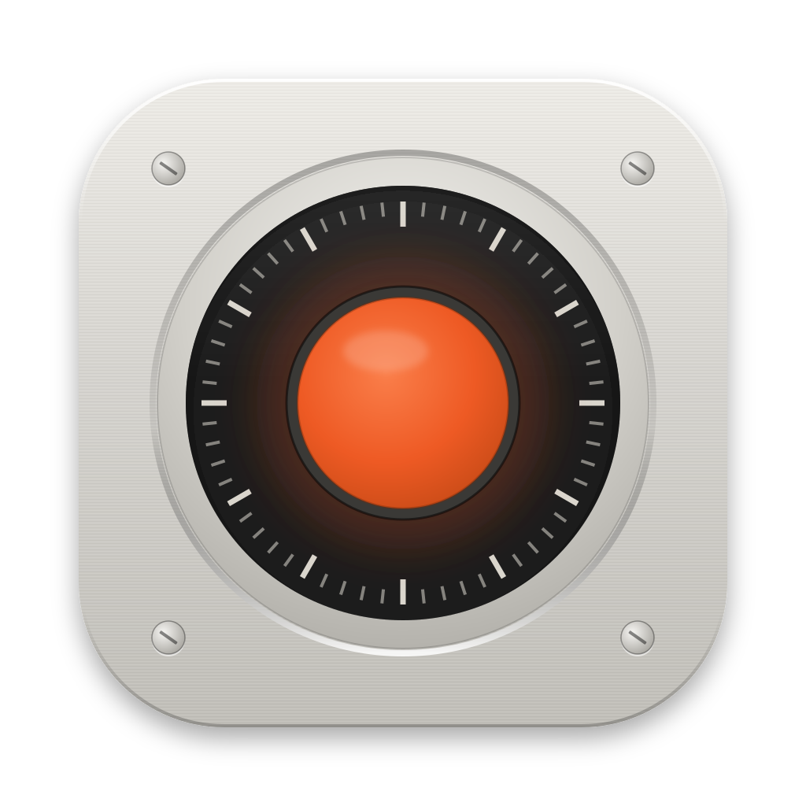
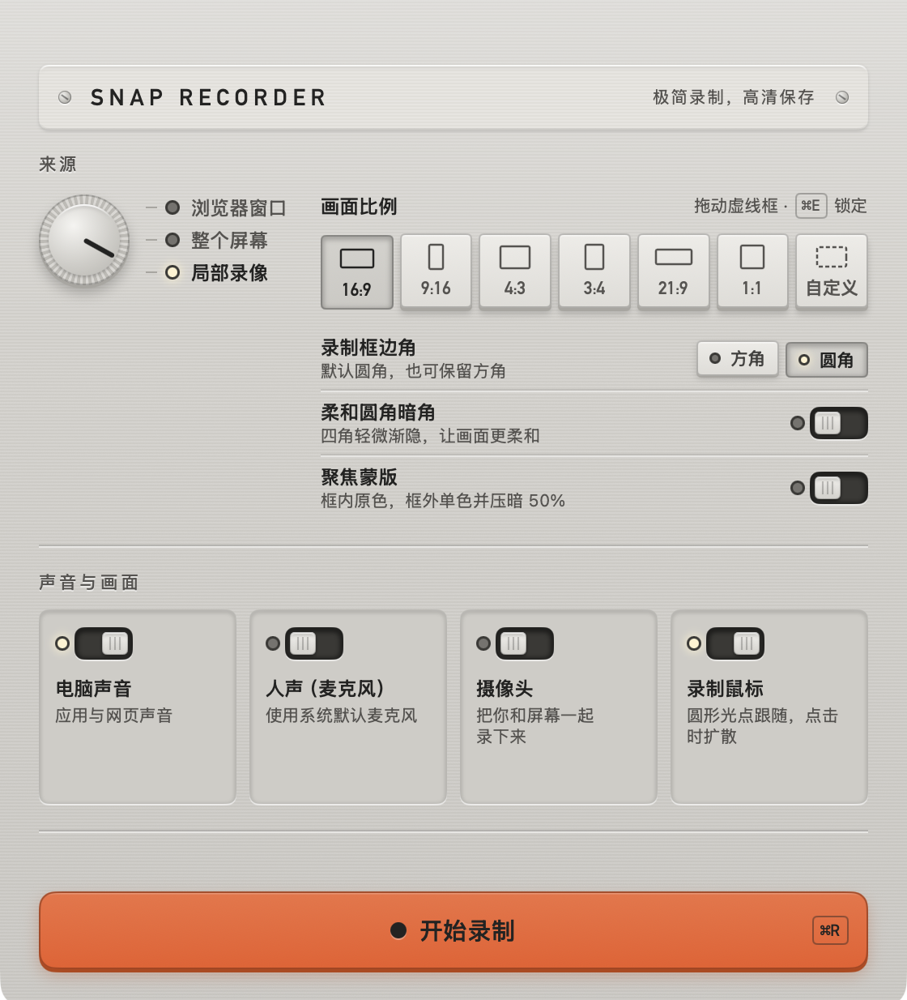
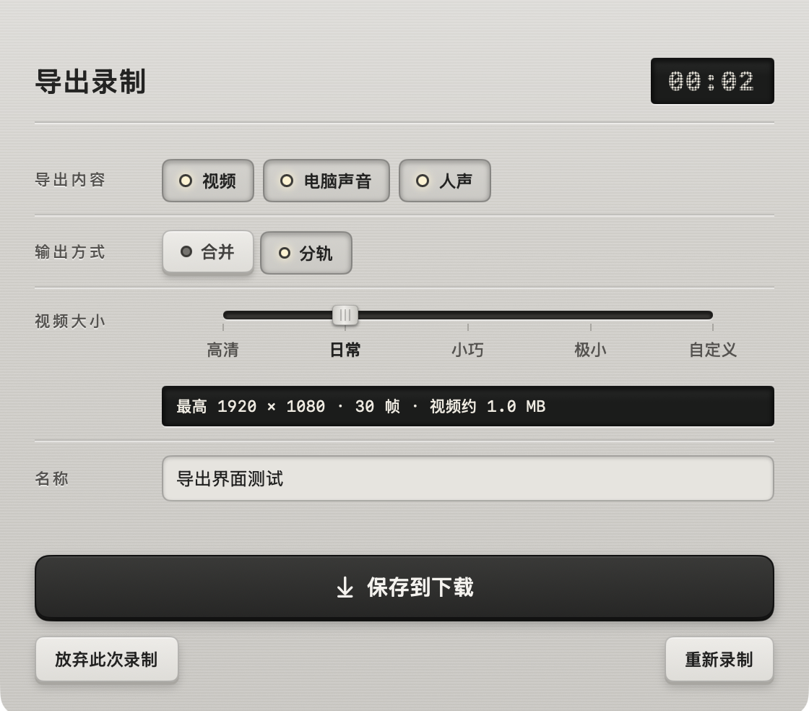

<div align="center">
  
  <h1>Snap Recorder</h1>
  <p><strong>极简录屏，自在导出。</strong></p>
  <p>录下任意窗口、整个屏幕或任意区域。视频、电脑声音、人声，按需合并或分轨。</p>
  <p>
    <a href="https://shuyan-5200.github.io/snap-recorder/"><strong>产品介绍</strong></a>
    &nbsp; · &nbsp;
    <a href="https://github.com/shuyan-5200/snap-recorder/releases/download/v1.5.0/Snap-Recorder-v1.5.0-macOS-universal.zip"><strong>下载 1.5.0</strong></a>
    &nbsp; · &nbsp;
    <a href="https://github.com/shuyan-5200/snap-recorder/releases/latest">版本与更新</a>
  </p>
  <p><sub>macOS 14+ · Apple Silicon / Intel · ZIP 约 2.2 MB · MIT 开源</sub></p>
  <p><sub>A lightweight, local-first macOS screen recorder with flexible video and audio exports.</sub></p>
</div>

<p align="center">
  
  <br>
  <sub>1.1 系列正式界面 · 真实 macOS 构建 · 2× 高清截图</sub>
</p>

## 关键亮点

- **三种录制来源**：任意窗口、整个屏幕、局部录像，保持原始画面比例。
- **声音自由组合**：勾选视频、电脑声音、人声，再选择合并或分轨；也能只导出声音。
- **五档视频大小**：高清、日常、小巧、极小、自定义。随手记录用极小，限制体积时直接填写 MB。
- **一次录制，多次导出**：保存前命名，保存后可换模式、大小或文件名继续导出；录得不满意可以直接放弃或重录。
- **可选人像与鼠标效果**：摄像头画中画、自然修饰、鼠标准星和点击波纹，按需开启。
- **全程本地处理**：无账号、无上传、无统计，文件保存到 Mac 的“下载”目录。

## 视觉理念：器物（Instrument）

像一台趁手的录音机：简洁、可靠，愿意常放在手边。Snap Recorder 用有触感的材质和清楚的机械状态，让数字工具多一点器物的温度；视觉服务于录制，不抢走画面的注意力。

- **拉丝铝与石墨**：铝灰面板、细刻线、上亮下暗的光影，配合内凹的深色读数窗；以克制的层次组织信息。
- **操作有回应，状态有位置**：旋钮指向来源，拨杆表示开关，实体键通过按下深度与指示灯反馈状态，不只靠颜色区分。
- **把橙色留给录制**：信号橙只用于标记录制目标、开始录制与录制状态，其余使用铝灰、石墨与暖白。应用图标、界面和产品页共用这套语言。

[浏览产品页的器物设计](https://shuyan-5200.github.io/snap-recorder/#design) · [正式视觉规范与设计变量](视觉规范/器物/)。本页两张界面图均为真实 macOS 构建的 2× 高清截图，可点击查看原图。

## 从录制到保存

**选择来源 → 3 秒倒计时 → 录制 → 选择导出内容、大小并命名 → 确认保存**

| 来源 | 适合的场景 |
| --- | --- |
| 任意窗口 | 默认选择 Snap Recorder 后方最前面的窗口，不打断当前操作；手动改选时，目标窗口会来到主面板后方并显示橙色发光框。可滚动列表先集中显示所有浏览器窗口，再显示其他应用；每组仍按系统当前前后顺序排列。列表只保留当前可见、有明确标题，并且所属应用能通过 `Command + Tab` 切换的正常窗口；不显示未命名、最小化、隐藏、其他 Space 或辅助进程窗口。成片完整保留窗口比例，不录入桌面或其他应用。多窗口应用首次精确置顶时会打开辅助功能设置，允许后返回程序即可自动完成置顶。 |
| 整个屏幕 | 显示所选屏幕的缩略图，适合跨应用演示。多屏时用左侧模式文字下方的数字方键切换；单屏时只显示唯一屏幕的缩略图。横屏和竖屏均按实际比例完整显示，不加黑边。 |
| 局部录像 | 自由调整带信号橙外发光的选区，提供 16:9、9:16、4:3、3:4、21:9、1:1 和自定义比例，可选圆角与聚焦蒙版。 |

电脑声音、人声和摄像头独立开关，人声与摄像头默认关闭。录制中可暂停、继续或结束。

3、2、1 倒计时同时显示在每块屏幕中央，不能拖动；电子滴答音只播放一份，最后一声略高。按 `Esc` 可立即取消，回到录前设置，所有倒计时一起消失。提示音和倒计时不会进入成片。

应用菜单、确认框和辅助面板跟随主窗口所在屏幕，不随录制目标屏幕切换。声音与画面的四张卡片说明统一为两行短中文。

主面板可以正常截图，开始录制时会自动收起；若要演示 Snap Recorder 本身，可从菜单栏打开主面板并拖入整屏或局部录制范围。倒计时、录制控制条、选区框与摄像头预览等辅助浮窗不会进入成片。

## 导出你需要的内容

录制结束后，“导出录制”从主窗口右侧展开，与左侧人像抽屉等宽。视频大小单独一排，下面是等宽的文件名和自定义上限输入框；非自定义档时，上限框灰显。完整参数保留在抽屉内，导出完成后可收起，继续下一次录制。

勾选**视频 / 电脑声音 / 人声**，每次选择一种输出方式。未录制的声音不可勾选。

| 选择 | 输出文件 |
| --- | --- |
| 三项全选 + 合并 | 一个带电脑声音与人声的 MP4。 |
| 三项全选 + 分轨 | 无声 MP4、电脑声音 M4A、人声 M4A，各一份。 |
| 只选电脑声音与人声 + 合并 | 一个混合声音的 M4A。 |
| 只选其中一项 | 单独的视频或音频文件。 |

例如，想保留“画面 + 电脑声音”，同时单独处理人声：先勾选视频和电脑声音，选择合并并保存；再只勾选人声，导出一份 M4A。

窗口录制默认使用开始录制时的窗口标题命名；整屏、局部录像或没有可用标题时，使用日期和时间。文件名可以直接修改，同名文件自动编号，不覆盖已有文件。分轨输出不会打包为 ZIP；独立人声保持原有音质，不随极小视频一起降质。麦克风实际收到的扬声器外放仍可能出现在人声中。

保存后留在同一工作区，可更换设置并点击“再导出一份”；旁边的“重新录制”带回转箭头，不再额外放一个“完成”按钮。尚未保存时，关闭抽屉或直接重录都会先确认。标题栏显示录制时长；输出尺寸、帧率、预计体积和自定义建议范围直接显示，不需要悬停查看。已保存的文件保留在下载目录，不在抽屉中展开文件列表。

<p align="center">
  
  <br>
  <sub>导出工作区沿用同一套器物语言；截图来自本次真实构建的内置演示录制。</sub>
</p>

## 视频大小按用途选择

| 档位 | 画面与帧率上限 | 适合用途 |
| --- | --- | --- |
| 高清（默认） | 原始录制像素 100%，30 帧 | 1:1 保留录制画面。 |
| 日常 | 原始录制像素 75%，30 帧 | 日常演示与分享。 |
| 小巧 | 原始录制像素 50%，30 帧 | 进一步节省空间。 |
| 极小 | 原始录制像素 25%，30 帧 | 随手记录，小字细节会减少。 |
| 自定义 | 30 帧；根据时长和 MB 上限等比适配 | 文件有明确大小限制。 |

所有档位都从本次录制的实际像素计算，保持画面比例，不再锁定到固定的 1080p、720p 或 480p，也不会放大低分辨率素材。界面会显示预计大小；四个固定档位保持所选像素比例，自定义按体积上限调整。自定义 MB 是**每个 MP4 的上限**，不得低于当前录制内容“极小”档的体积预算；界面按时长、尺寸和所选音轨建议从该下限到原片大小附近的范围。独立音频文件另计。

高清会尝试保守压缩；如果文件反而增大，或抽样画面损失过多，且原片不超过 30 fps，则保留原片。旧版 60 fps 原片会转为 30 fps，不直接保留。不承诺所有录屏都能在清晰度不变的情况下大幅缩小。编码依据与历史实测见[导出流程与体积优化](docs/export-redesign.md)。

## 人像与演示效果

开启摄像头后可预览人像，支持圆角方形 / 圆形、三档大小、四角位置与镜像。自然修饰提供原图、自然、柔和三档，仅在本机处理摄像头画面，不瘦脸、不美妆、不识别身份。人像外圈带一道铝质边框，预览与成片一致；人像直接合入视频，不另导出摄像头文件；停止录制或关闭摄像头后释放设备。

摄像头开关位于最左侧，开启后“人像样式”自动从左侧平滑展开，所有设置一次看全，不需要滚动。形状与大小分为上下两排；左右抽屉的外框等宽等高，各区块统一标题在上、选项在下，按钮等宽分配，沿用同一套分隔线与底部操作区。主面板仍可操作，抽屉随主窗口一起移动；关闭或点“完成”后平顺收起。三种录制模式及左右抽屉共用固定的主窗口高度，开合只改变宽度；来源旋钮和模式选项位置固定，切换模式只更换右侧内容。

空闲时点击主窗口左上角关闭会彻底退出应用；录制或导出关键状态仍会先确认，避免误关丢失内容。

鼠标可显示为白色准星（细圆环加四道短刻线，外描深色，深浅画面上都清楚），点击时圆环向外扩散；关闭“录制鼠标”后隐藏鼠标。局部录像的聚焦蒙版保留框内原色，将框外转为单色并压暗。

| 快捷键 | 作用 |
| --- | --- |
| `⌘R` | 开始录制；窗口与整屏模式需主面板在前台，局部模式锁定后可全局使用。 |
| `⌘E` | 局部模式中切换选区调整与点击穿透。 |
| `Esc` | 倒计时中立即取消；录制中或暂停时，全局结束录制。 |

## 安装

1. [下载 1.5.0 安装包](https://github.com/shuyan-5200/snap-recorder/releases/download/v1.5.0/Snap-Recorder-v1.5.0-macOS-universal.zip)，解压后把 `Snap Recorder.app` 拖入“应用程序”。
2. 首次启动允许“屏幕与系统音频录制”；需要人声或人像时，再分别允许麦克风与摄像头。
3. 选择来源，开始录制。

支持 **macOS 14+**、Apple Silicon 与 Intel Mac；**人声录制需要 macOS 15+**。当前版本为 **1.5.0 / build 20**，Universal ZIP 约 **2.2 MB**。[查看发布记录与历史版本](https://github.com/shuyan-5200/snap-recorder/releases)。

应用尚未经过 Apple 公证。首次启动若被 macOS 拦截，请右键应用选择“打开”；仍被拦截时，前往“系统设置”→“隐私与安全性”→“仍要打开”。

<details>
<summary>屏幕录制权限反复出现</summary>

如果以前运行过旧签名或其他位置的副本，请完全退出应用，只从“应用程序”中的同一份 Snap Recorder 启动。在系统设置的“屏幕与系统音频录制”中移除旧条目，再重新授权并按提示重启。条目仍异常时可在终端执行：

```bash
tccutil reset ScreenCapture io.github.shuyan-5200.SnapRecorder
```

</details>

## 从源码构建

使用 SwiftUI、AppKit、ScreenCaptureKit、Core Image、Vision 与 AVFoundation，无第三方库。可使用 SwiftPM 构建，无需完整 Xcode。

```bash
git clone https://github.com/shuyan-5200/snap-recorder.git
cd snap-recorder
./scripts/build-app.sh
```

构建结果为 `build/Snap Recorder.app`。运行自动自检：

```bash
swift build -c release
.build/release/SnapRecorder --self-test
```

## 隐私与边界

所有屏幕、摄像头画面和声音只在本机处理，不联网、不上传、不收集统计。详见[隐私说明](PRIVACY.md)。

当前不提供编辑器、剪辑、自动变焦、摄像头分轨或云分享；DRM 受保护内容可能显示为黑屏。

更多信息：[器物视觉规范](视觉规范/器物/index.html) · [产品规格](docs/product-spec.md) · [技术说明](docs/technical-notes.md) · [验证记录](docs/verification.md) · [贡献指南](CONTRIBUTING.md)。

## License

[MIT License](LICENSE)。感谢 [kennanzhou](https://github.com/kennanzhou/snap-recorder-Partial-recording) 贡献局部录像、聚焦蒙版与鼠标效果等改进。
